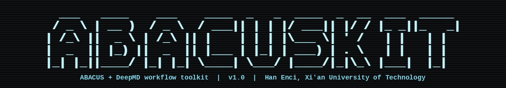

# abacuskit



`abacuskit` 是一个集成式 ABACUS + DeepMD 命令行程序，用于生成 ABACUS 输入文件、准备批量任务、检查/汇总计算结果，并把 ABACUS 输出转换为 DeepMD 数据。

- Version: v1.1.0
- Author: Han Enci, Zhong Lisheng, Yu Yutong, Xu Mengting, Chen Jingyuan
- Affiliation: Xi'an University of Technology

## v1.1 更新记录

- 简化交互菜单 5 号功能：输入 `5` 后直接检查当前目录下的 ABACUS 任务状态并自动退出。
- 增强 ABACUS 输出识别：可自动识别当前目录、`OUT.<suffix>` 输出目录，或当前目录下的多个任务子目录。
- 检查结果新增任务类型和输出目录显示，并报告是否结束、是否收敛、是否失败和收敛后的最终能量。
- 增加 ELF、电荷密度和电荷密度差 cube 文件绘图功能，并补充对应 INPUT 模板选项。

## 安装

从 GitHub 安装：

```bash
pip install git+https://github.com/EnciHan/abacuskit.git
```

从本地源码安装：

```bash
git clone https://github.com/EnciHan/abacuskit.git
cd abacuskit
pip install .
```

可选功能依赖：

```bash
pip install "abacuskit[plot]"      # DOS/PDOS/LDOS 绘图
pip install "abacuskit[deepmd]"    # collect-deepmd 数据转换
```

安装后检查入口：

```bash
abacuskit --version
abacuskit -h
```

也可以像 VASPKIT 一样直接进入数字菜单：

```bash
abacuskit
```

启动后会先显示终端版 `abacuskit` ASCII logo，再进入数字菜单。

新增的本地测试/汇总入口：

```text
10   Generate ABACUS KPT
11   Prepare convergence-test jobs
12   Collect ABACUS metrics / report
13   Create ABACUS launch scripts
14   Plot ELF / charge density / charge-density difference
```

常用的 CIF 转 STRU 菜单流程：

```text
1    CIF -> ABACUS STRU
101  Generate STRU now using current settings
```

输入 `1` 后进入 `10x` 二级菜单。默认设置是 efficiency LCAO 基组、无磁矩、无固定原子、不扩胞、输出 `STRU`；如果当前目录只有一个 `.cif` 文件，输入 `101` 就会直接生成。
`101` 成功生成 `STRU` 后会自动退出程序。

常用 `10x` 编号：

```text
101  Generate STRU now using current settings
102  Set orbital basis to precision
103  Set magnetic moment, e.g. Ni 2
104  Set supercell, e.g. 2 2 1
105  Fix by element, e.g. Ni z
106  Fix by atom index, e.g. 1-10 z
107  Fix by coordinate cutoff, e.g. below z 5.0 xyz
108  Select/change CIF file
109  Change output STRU path
110  Reset to defaults
111  Set orbital basis to efficiency
112  Clear magnetic moments
113  Clear fixed atom settings
0    Back to previous menu
q    Quit abacuskit
```

例如：先输入 `1`，再输入 `102` 切到 precision 基组，程序会自动回到 `10x` 菜单；再输入 `103`，按提示输入 `Ni 2`，再回到 `10x` 菜单；最后输入 `101` 生成 `STRU`。

常用的 ABACUS 输出检查菜单流程：

```text
5    Check ABACUS job status
```

输入 `5` 后会直接检查当前目录 `.`。如果当前目录本身是 ABACUS 任务目录、`OUT.<suffix>` 输出目录，或当前目录下包含多个 ABACUS 任务目录，程序会自动识别。检查完成后会输出自动识别到的任务类型、输出目录、是否结束、是否收敛、是否失败，以及收敛后的最终能量，随后自动退出程序。

常用的 INPUT 生成菜单流程：

```text
3    Generate ABACUS INPUT
301  Generate INPUT now using current settings
```

输入 `3` 后进入 `30x` 二级菜单。默认设置是 scf、efficiency LCAO 基组、gpu、cusolver、`kspacing=0.14`、`ecutwfc=100`、`nspin=1`、输出 `INPUT`。输入 `301` 会按当前设置生成 `INPUT`，成功后自动退出程序。

常用 `30x` 编号：

```text
301  Generate INPUT now using current settings
302  Set calculation to scf
303  Set calculation to relax
304  Set orbital basis to precision
305  Set orbital basis to efficiency
306  Set nspin
307  Set ecutwfc
308  Set kspacing
309  Set device, gpu or cpu
310  Set ks_solver
311  Toggle cal_stress
312  Toggle DOS/PDOS output
313  Add extra INPUT key=value
314  Change output INPUT path
315  Change suffix
316  Set relax parameters
317  Clear extra INPUT settings
318  Reset to defaults
319  Set VDW correction, e.g. d3_bj / d3_0 / d2
320  Toggle dipole correction, default Z axis
321  Apply DOS target template
322  Apply PDOS target template
323  Apply band structure target template
324  Apply COHP matrix-output template
325  Apply work-function/potential template
326  Enable/edit DFT+U
327  Apply DFT+U convergence-aid template
328  Disable DFT+U
329  Clear DFT+U convergence-aid settings
330  Apply ELF cube-output template
331  Apply charge-density cube-output template
0    Back to previous menu
q    Quit abacuskit
```

模板说明：

- `319` 会写入 `vdw_method`，可选 `d3_bj`、`d3_0`、`d2` 或关闭。
- `320` 会写入 `efield_flag true`、`dip_cor_flag true`、`efield_dir 2`、`efield_amp 0`，默认 Z 方向偶极修正。
- `321` / `322` 会切到 `nscf` 并设置 `init_chg=file`、`read_file_dir=./`、`out_dos` 等参数；需要先有 SCF 电荷密度并准备较密 KPT。
- `323` 会切到 `nscf` 并设置 `out_band=1`、`out_proj_band=1`；需要自己准备 line-mode `KPT`。
- `324` 会打开 `out_mat_hs2/out_mat_hs`，作为 COHP 后处理所需 H/S 矩阵输出模板。
- `325` 会打开 `out_pot=2` 和 Z 方向偶极修正，作为 slab 功函数/静电势模板。
- `330` 会写入 `out_elf="1 3"`，让 ABACUS 在 `OUT.<suffix>` 输出 ELF cube。
- `331` 会写入 `out_chg="1 3"`，让 ABACUS 在 `OUT.<suffix>` 输出电荷密度 cube。
- 设置 `nspin=2` 后，生成的 `INPUT` 会显式写出 `mixing_beta_mag`、`mixing_gg0`、`mixing_gg0_mag`、`mixing_gg0_min`、`mixing_restart`、`mixing_dmr`，方便后续手动调磁性态收敛。
- `326` 会写入 DFT+U 参数：`dft_plus_u`、`orbital_corr`、`hubbard_u`、`yukawa_potential`、`omc`，mode 1 还会写入 `onsite_radius`。`orbital_corr` 和 `hubbard_u` 的列表顺序要与 `STRU` 里的原子类型顺序一致。
- `327` 会写入 DFT+U 常用收敛辅助参数：`mixing_restart`、`mixing_dmr`、`uramping`。

## 路径配置

`abacuskit` 不会自带 ABACUS、赝势库、轨道库或 DeepMD-kit。请用命令行参数传入路径，或设置下面的环境变量作为默认值：

```bash
export ABACUSKIT_PSEUDO_DIR=/path/to/pseudopotentials
export ABACUSKIT_ORBITAL_EFFICIENCY_DIR=/path/to/orbitals-efficiency
export ABACUSKIT_ORBITAL_PRECISION_DIR=/path/to/orbitals-precision
export ABACUSKIT_ABACUS_ROOT=/path/to/abacus/installations
export ABACUSKIT_ABACUS_ENV=/path/to/abacus/toolchain/abacus_env.sh
export ABACUSKIT_DEEPMD_PYTHON=/path/to/deepmd/python
export ABACUSKIT_DP=/path/to/dp
```

也可以在每次运行时显式指定，例如 `--pseudo-dir`、`--orbital-dir`、`--abacus-env`、`--python`。

## 1. CIF 转 ABACUS STRU

```bash
abacuskit cif2stru /path/to/structure.cif -o STRU
```

常用选项：

```bash
--orbital-quality precision
--pseudo-dir /path/to/upf_dir
--orbital-dir /path/to/orb_dir
--element-orbital-quality C=precision
--element-orbital-quality Ni=efficiency
--orbital-file Ni=/path/to/Ni_exact.orb
--pseudo-file Ni=/path/to/Ni_exact.upf
--supercell 2 2 1
--mag Ni=2 --mag Fe=3
--fix-element Ni=z
--fix-index 1-10,15=xy
--fix-below z=5.0:xyz
--fix-above z=25.0:z
```

固定原子规则里，`x/y/z` 表示要固定的方向；生成到 STRU 后对应方向的 move flag 会写成 `0`，未固定方向保持 `1`。

## 2. 从一个 CIF 生成一批待标注结构

```bash
abacuskit make-candidates seed.cif \
  --out 01_candidates \
  --count 100 \
  --rattle 0.03 \
  --strain 0.01
```

`--rattle` 单位是 Angstrom；`--strain` 是随机对称晶胞应变幅度。

## 3. 生成 ABACUS INPUT 模板

模板参数按 ABACUS 文档检查过：`calculation` 支持 `scf`、`relax` 等；`relax_nmax` 控制结构优化最大离子步；`force_thr_ev` 是 eV/Angstrom 单位的力收敛阈值；`out_dos=2` 在 LCAO 下会输出 DOS 与 PDOS。

SCF 模板：

```bash
abacuskit input-template \
  --kind scf \
  --out INPUT.scf \
  --nspin 2 \
  --dos \
  --set vdw_method=d3_bj
```

`--nspin 2` 会自动补出磁性混合收敛参数。DFT+U 也可以直接通过 `--set` 写入，例如：

```bash
abacuskit input-template \
  --kind scf \
  --out INPUT.dftu \
  --nspin 2 \
  --set dft_plus_u=1 \
  --set "orbital_corr=-1 2 -1" \
  --set "hubbard_u=0 4.0 0"
```

Relax 模板：

```bash
abacuskit input-template \
  --kind relax \
  --out INPUT.relax \
  --nspin 2 \
  --cal-stress \
  --relax-nmax 100 \
  --force-thr-ev 0.04
```

## 4. 生成 ABACUS 标注任务

```bash
abacuskit prepare-abacus 01_candidates \
  --out 02_abacus_sp \
  --cal-stress \
  --nspin 2 \
  --mag Ni=2 \
  --mpi-np 1 \
  --gpu-ids 0
```

这会为每个 CIF 生成：

- `STRU`
- `INPUT`
- `run_abacus.sh`
- `metadata.json`
- 顶层 `run_all_abacus.sh`

运行全部任务：

```bash
bash 02_abacus_sp/run_all_abacus.sh
```

额外 ABACUS 参数可以用 `--set key=value` 追加，例如：

```bash
--set vdw_method=d3_bj --set mixing_beta=0.05
```

元素级基组选择也可以直接用于批量任务：

```bash
abacuskit prepare-abacus 01_candidates \
  --out 02_abacus_sp \
  --element-orbital-quality C=precision \
  --element-orbital-quality H=efficiency \
  --element-orbital-quality O=precision \
  --element-orbital-quality Ni=efficiency \
  --mag Ni=2 \
  --fix-below z=5.0:xyz
```

## 5. 创建 ABACUS 启动脚本

给已有任务目录自动补 `run_abacus.sh` 和总启动脚本。建议先设置 `ABACUSKIT_ABACUS_ENV`，或通过 `--abacus-env` 显式传入 ABACUS 环境脚本：

```bash
abacuskit launch-script 02_abacus_sp \
  --mpi-np 1 \
  --gpu-ids 0 \
  --omp-threads 12 \
  --array-script 02_abacus_sp/run_all_abacus.sh
```

生成的单任务脚本默认包含：

```text
CUDA_VISIBLE_DEVICES=0
OMP_NUM_THREADS=12
numactl --physcpubind=0-11 --membind=0 mpirun -np 1 --bind-to none abacus
```

查看本机可用 ABACUS 版本：

```bash
abacuskit abacus-versions
```

菜单里输入 `13` 可以交互式创建启动脚本。

## 6. 生成 KPT

参考 `abacustest prepare` 里的 KPT 写法，`abacuskit` 现在可以直接生成 ABACUS 的 Gamma/MP 网格 KPT：

```bash
abacuskit kpt \
  --mesh 3 3 1 \
  --shift 0 0 0 \
  --model gamma \
  --out KPT
```

菜单里输入 `10` 也可以交互式生成。

## 7. 准备收敛测试任务

参考 `abacustest model conv` 的思路，可以从已有 ABACUS 任务目录复制出一组测试目录，并批量改写某个 `INPUT` 参数：

```bash
abacuskit conv-test 02_abacus_sp/000000 \
  --key ecutwfc \
  --values 80 100 120 150 \
  --out conv_ecutwfc
```

也可以扫 K 点，此时会生成/覆盖每个子任务里的 `KPT`：

```bash
abacuskit conv-test 02_abacus_sp/000000 \
  --key kpt \
  --values "2 2 1" "3 3 1" "4 4 1" \
  --out conv_kpt
```

输出目录里会包含 `jobs.txt`、`run_all_abacus.sh`、`conv_manifest.json`，可以直接：

```bash
bash conv_ecutwfc/run_all_abacus.sh
```

## 8. 检查 ABACUS 任务是否结束和收敛

```bash
abacuskit check-abacus 02_abacus_sp \
  --json check_report.json \
  --csv check_report.csv
```

检查逻辑会读取 `OUT.<suffix>/running_*.log`，识别 `Finish Time`、`final etot`、`charge density convergence is achieved`、`convergence has not been achieved` 等信息，并输出 `finished/converged/failed/energy_ev`。

## 9. 汇总 metrics 并生成 HTML 报告

参考 `abacustest collectdata/outresult/report` 的本地结果汇总流程，`abacuskit` 增加了常用 ABACUS 指标收集：

```bash
abacuskit collect-metrics 02_abacus_sp \
  --json metrics.json \
  --csv metrics.csv
```

默认会汇总 `normal_end`、`converge`、`energy`、`energy_per_atom`、`natom`、`ecutwfc`、`kspacing`、`kpt`、`nspin`、`total_mag`、`efermi`、`total_time`、`scf_steps` 等字段。也可以指定输出列：

```bash
abacuskit collect-metrics conv_ecutwfc \
  --json conv_metrics.json \
  --csv conv_metrics.csv \
  --metrics job converge ecutwfc energy_per_atom total_time
```

生成本地 HTML 报告：

```bash
abacuskit report-metrics \
  --metrics metrics.json \
  --out abacuskit_report.html
```

菜单里输入 `12` 会先收集 metrics，再询问是否生成 HTML 报告。

## 10. 绘制 DOS / PDOS / LDOS

ABACUS 的 DOS 文件通常是 `DOS1_smearing.dat`；LCAO 且 `out_dos 2` 会同时生成 `PDOS` 文件。PDOS 选择器写法是 `元素=轨道`，轨道支持 `s/p/d/f/g`。

```bash
abacuskit plot-dos OUT.ABACUS \
  --kind dos \
  --out dos.png

abacuskit plot-dos OUT.ABACUS \
  --kind pdos \
  --select C=p \
  --select H=s \
  --select O=p \
  --select Ni=d \
  --out pdos_selected.png

abacuskit plot-dos OUT.ABACUS \
  --kind ldos \
  --out ldos.png
```

LDOS 支持 ABACUS 的 `LDOS.txt` 线扫描文件；如果输出的是 `LDOS_*eV.cube`，脚本会自动画 cube 中间切片。

## 11. 绘制 ELF / 电荷密度 / 电荷密度差

先用 `3 -> 330` 或 `3 -> 331` 生成包含 `out_elf 1 3` / `out_chg 1 3` 的 `INPUT`，运行 ABACUS 后会在 `OUT.<suffix>` 下得到 cube 文件。

绘制 ELF 或电荷密度 cube 的中间切片：

```bash
abacuskit plot-grid OUT.ABACUS \
  --kind elf \
  --out elf.png

abacuskit plot-grid OUT.ABACUS \
  --kind charge \
  --out charge.png
```

计算两个电荷密度 cube 的差值并绘图，同时保存差分 cube：

```bash
abacuskit plot-grid adsorbed/OUT.ABACUS \
  --kind diff \
  --minus clean/OUT.ABACUS \
  --cube-out charge_diff.cube \
  --out charge_diff.png
```

默认画 `z` 方向中间切片；可用 `--axis x|y|z` 和 `--index N` 指定切片。

## 12. ABACUS 输出转 DeepMD 数据

```bash
abacuskit collect-deepmd 02_abacus_sp \
  --out 03_deepmd_data \
  --split-ratio 0.1
```

转换使用 `dpdata`，会自动根据 `INPUT` 里的 `calculation` 选择：

- `abacus/scf`
- `abacus/md`
- `abacus/relax`

转换报告写入 `03_deepmd_data/collect_report.json`。

## 12. 生成 DeepMD 训练输入并训练

```bash
abacuskit make-train 03_deepmd_data/train/* \
  --valid-systems 03_deepmd_data/valid/* \
  --out 04_train/input.json \
  --steps 100000

cd 04_train
bash run_deepmd.sh
```

如果 `type_map.raw` 不存在或需要固定元素顺序，可以显式传：

```bash
--type-map C H O Ni
```

## 13. 一键生成流程骨架

```bash
abacuskit init-workflow --out my_abacus_deepmd_project
```

生成目录：

```text
00_cif/
01_candidates/
02_abacus_sp/
03_deepmd_data/
04_train/
README_workflow.md
```

## 参考文档

- ABACUS INPUT 主参数文档：`https://abacus.deepmodeling.com/en/latest/advanced/input_files/input-main.html`
- ABACUS DOS/PDOS 文档：`https://abacus.deepmodeling.com/en/latest/advanced/elec_properties/dos.html`
