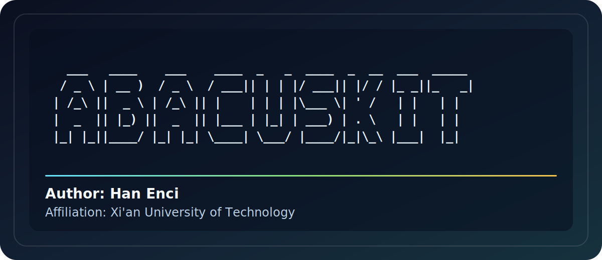

# abacuskit



`abacuskit` 是一个集成式 ABACUS + DeepMD 命令行程序，用于生成 ABACUS 输入文件、准备批量任务、检查/汇总计算结果，并把 ABACUS 输出转换为 DeepMD 数据。

- Version: v1.2.1
- Author: Han Enci, Zhong Lisheng, Yu Yutong, Xu Mengting, Chen Jingyuan
- Affiliation: Xi'an University of Technology

## v1.2.1 更新记录

- 修复交互菜单二级编号错位：`2` 进入 INPUT 菜单后使用 `20x`，避免与 KPT 的 `30x` 冲突。
- 修复 BAND/DOS 模板：`nscf` 输入不再写 `kspacing`，避免 ABACUS 覆盖 line-mode KPT。
- BAND/DOS 模板自动使用 precision LCAO 基组，并同步当前目录 `STRU` 的 `NUMERICAL_ORBITAL`。
- 增强后处理兼容性：BAND 绘图支持 `band.txt`，DOS 绘图支持 `TDOS.dat`。
- 增强 ABACUS 状态检查：识别 `#SCF IS CONVERGED#` 收敛标记。

## v1.2 更新记录

- 新增 `301` / `302` KPT 生成入口：支持从当前目录自动识别 `STRU`、`POSCAR`、`CONTCAR` 或 CIF，生成普通 Gamma mesh KPT，或用 SeeK-path/HPKOT 生成能带高对称路径 KPT。
- 新增 BAND 自动后处理：读取 `BANDS_*.dat`、line-mode `KPT` 和 Fermi 能，输出 `band.png`，并报告带隙、VBM/CBM 与直接/间接带隙。
- 新增 STRU 结构工具：按坐标范围固定原子、将 Z 真空方向转换为 Y 真空方向、将 STRU 转 CIF，并修复 STRU 转 CIF 时晶胞方向被 ASE 规范化导致真空方向看起来未改变的问题。
- 新增 APNS 赝势和轨道库路径自动搜索与保存功能，搜索结果写入 `~/.abacuskit/config.json`，后续生成输入时自动使用。
- 新增内置 ABACUS LCAO COHP/COOP 后处理：读取 `data-*-H`、`data-*-S`、`WFC_NAO_K*.txt`、`kpoints` 和 `running_scf.log`，支持 atom index + shell 或全局 NAO index 选择，输出 `.dat`、`_EminusEf.dat`、`.png`、`.json`。
- 新增 ICOHP 输出：对 COHP/COOP 曲线积分到 `E_Fermi`，同时给出原始 `ICOHP` 和反号约定的 `-ICOHP`，并写入 `.icohp.txt` 与 metadata。
- 重新整理交互菜单：`1-7` 为输入/结构工具，`8-13` 为后处理，`14-22` 为批量任务和工作流。
- 新增依赖 `seekpath` 和 `spglib`，用于高对称路径生成。

## v1.1.1 更新记录

- 修复 `cell-relax` / relax 任务中前面步骤出现 `not converged`、但最终日志显示 `Relaxation is converged!` 时被误判为未收敛的问题。
- 多个 `running_*.log` 存在时，优先检查最新日志。
- 重新整理交互菜单分类：输入/任务、后处理、批量/工作流分组显示，并新增后处理里的 COHP 矩阵输出 INPUT 生成入口。

## v1.1 更新记录

- 简化 ABACUS 状态检查入口：选择后直接检查当前目录下的 ABACUS 任务状态并自动退出。
- 增强 ABACUS 输出识别：可自动识别当前目录、`OUT.<suffix>` 输出目录，或当前目录下的多个任务子目录。
- 检查结果新增任务类型和输出目录显示，并报告是否结束、是否收敛、是否失败和收敛后的最终能量。
- 增加 ELF、电荷密度和电荷密度差 cube 文件绘图功能，并补充对应 INPUT 模板选项。

## 安装

从 GitHub 安装：

```bash
pip install git+https://github.com/EnciHan/abacuskit.git
```

从本地源码安装：

```bash
git clone https://github.com/EnciHan/abacuskit.git
cd abacuskit
pip install .
```

可选功能依赖：

```bash
pip install "abacuskit[plot]"      # BAND/DOS/PDOS/LDOS/ELF/电荷密度绘图
pip install "abacuskit[deepmd]"    # collect-deepmd 数据转换
```

安装后检查入口：

```bash
abacuskit --version
abacuskit -h
```

也可以像 VASPKIT 一样直接进入数字菜单：

```bash
abacuskit
```

启动后会先显示终端版 `abacuskit` ASCII logo，再进入数字菜单。

顶层菜单按“输入/任务、后处理、批量/工作流”分类：

```text
1    CIF -> ABACUS STRU
2    Generate ABACUS INPUT
3    Generate ABACUS KPT
4    Check ABACUS job status
5    Fix STRU atoms by coordinate range
6    Rotate STRU vacuum direction Z -> Y
7    Convert STRU to CIF

8    Plot charge density
9    Plot charge-density difference
10   Plot ELF
11   Plot DOS / PDOS / LDOS
12   Auto plot BAND for current directory
13   ABACUS LCAO COHP

14   Prepare ABACUS jobs
15   Make candidate CIFs
16   Prepare convergence-test jobs
17   Collect ABACUS metrics / report
18   Create ABACUS launch scripts
19   Collect ABACUS outputs to DeepMD data
20   Make DeepMD training input
21   Init workflow skeleton

22   Search/save APNS pseudopotential and orbital paths
```

常用的 CIF 转 STRU 菜单流程：

```text
1    CIF -> ABACUS STRU
101  Generate STRU now using current settings
```

输入 `1` 后进入 `10x` 二级菜单。默认设置是 efficiency LCAO 基组、无磁矩、无固定原子、不扩胞、输出 `STRU`；如果当前目录只有一个 `.cif` 文件，输入 `101` 就会直接生成。
`101` 成功生成 `STRU` 后会自动退出程序。

常用 `10x` 编号：

```text
101  Generate STRU now using current settings
102  Set orbital basis to precision
103  Set magnetic moment, e.g. Ni 2
104  Set supercell, e.g. 2 2 1
105  Fix by element, e.g. Ni z
106  Fix by atom index, e.g. 1-10 z
107  Fix by coordinate cutoff, e.g. below z 5.0 xyz
108  Select/change CIF file
109  Change output STRU path
110  Reset to defaults
111  Set orbital basis to efficiency
112  Clear magnetic moments
113  Clear fixed atom settings
0    Back to previous menu
q    Quit abacuskit
```

例如：先输入 `1`，再输入 `102` 切到 precision 基组，程序会自动回到 `10x` 菜单；再输入 `103`，按提示输入 `Ni 2`，再回到 `10x` 菜单；最后输入 `101` 生成 `STRU`。

常用的 ABACUS 输出检查菜单流程：

```text
4    Check ABACUS job status
```

输入 `4` 后会直接检查当前目录 `.`。如果当前目录本身是 ABACUS 任务目录、`OUT.<suffix>` 输出目录，或当前目录下包含多个 ABACUS 任务目录，程序会自动识别。检查完成后会输出自动识别到的任务类型、输出目录、是否结束、是否收敛、是否失败，以及收敛后的最终能量，随后自动退出程序。

常用的 INPUT 生成菜单流程：

```text
2    Generate ABACUS INPUT
201  Generate INPUT now using current settings
```

输入 `2` 后进入 `20x` 二级菜单。默认设置是 scf、efficiency LCAO 基组、gpu、cusolver、`kspacing=0.14`、`ecutwfc=100`、`nspin=1`、输出 `INPUT`。输入 `201` 会按当前设置生成 `INPUT`，成功后自动退出程序。

常用 `20x` 编号：

```text
201  Generate INPUT now using current settings
202  Set calculation to scf
203  Set calculation to relax
204  Set orbital basis to precision
205  Set orbital basis to efficiency
206  Set nspin
207  Set ecutwfc
208  Set/enable kspacing
209  Set device, gpu or cpu
210  Set ks_solver
211  Toggle cal_stress
212  Toggle DOS/PDOS output
213  Add extra INPUT key=value
214  Change output INPUT path
215  Change suffix
216  Set relax parameters
217  Clear extra INPUT settings
218  Reset to defaults
219  Set VDW correction, e.g. d3_bj / d3_0 / d2
220  Toggle dipole correction, default Z axis
221  Apply DOS target template
222  Apply PDOS target template
223  Apply band structure target template
224  Apply COHP output template
225  Apply work-function/potential template
226  Enable/edit DFT+U
227  Apply DFT+U convergence-aid template
228  Disable DFT+U
229  Clear DFT+U convergence-aid settings
230  Apply ELF cube-output template
231  Apply charge-density cube-output template
0    Back to previous menu
q    Quit abacuskit
```

模板说明：

- `219` 会写入 `vdw_method`，可选 `d3_bj`、`d3_0`、`d2` 或关闭。
- `220` 会写入 `efield_flag true`、`dip_cor_flag true`、`efield_dir 2`、`efield_amp 0`，默认 Z 方向偶极修正。
- `221` / `222` 会切到 `nscf` 并设置 `init_chg=file`、`read_file_dir=./`、`out_dos` 等参数，同时不写 `kspacing`；生成 INPUT 时会自动使用 precision LCAO `orbital_dir`，并把当前目录 `STRU` 的 `NUMERICAL_ORBITAL` 同步成 precision 轨道文件。需要先有 SCF 电荷密度并准备较密 KPT。
- `223` 会切到 `nscf` 并设置 `out_band=1`、`out_proj_band=1`，同时不写 `kspacing`；生成 INPUT 时会自动使用 precision LCAO `orbital_dir`，并把当前目录 `STRU` 的 `NUMERICAL_ORBITAL` 同步成 precision 轨道文件。需要自己准备 line-mode `KPT`，避免 ABACUS 按 `kspacing` 自动生成网格并覆盖高对称路径。
- `224` 会切到 LCAO SCF，并写入 `out_mat_hs="1 8"`、`out_wfc_lcao=1`、`out_app_flag=1`，作为内置 COHP/COOP 后处理所需输出模板。
- `225` 会打开 `out_pot=2` 和 Z 方向偶极修正，作为 slab 功函数/静电势模板。
- `230` 会写入 `out_elf="1 3"`，让 ABACUS 在 `OUT.<suffix>` 输出 ELF cube。
- `231` 会写入 `out_chg="1 3"`，让 ABACUS 在 `OUT.<suffix>` 输出电荷密度 cube。
- 设置 `nspin=2` 后，生成的 `INPUT` 会显式写出 `mixing_beta_mag`、`mixing_gg0`、`mixing_gg0_mag`、`mixing_gg0_min`、`mixing_restart`、`mixing_dmr`，方便后续手动调磁性态收敛。
- `226` 会写入 DFT+U 参数：`dft_plus_u`、`orbital_corr`、`hubbard_u`、`yukawa_potential`、`omc`，mode 1 还会写入 `onsite_radius`。`orbital_corr` 和 `hubbard_u` 的列表顺序要与 `STRU` 里的原子类型顺序一致。
- `227` 会写入 DFT+U 常用收敛辅助参数：`mixing_restart`、`mixing_dmr`、`uramping`。

## 路径配置

`abacuskit` 不会自带 ABACUS 或 DeepMD-kit。APNS 赝势和轨道库会优先自动搜索下面三个目录名，因此常规安装后一般不用再手动 `export`：

```text
apns-pseudopotentials-v1
apns-orbitals-efficiency-v1
apns-orbitals-precision-v1
```

自动搜索会检查当前目录、用户目录下常见的 `data/abacus-lib`、`apps` 等位置，也可以用 `ABACUSKIT_APNS_ROOT` 或 `ABACUSKIT_APNS_SEARCH_ROOTS` 指定搜索根目录。显式环境变量仍然优先级最高，适合机器上有多个库版本或需要指定自定义路径时使用：

在交互菜单中输入 `22`，程序会自动扫描这三个路径并直接写入 `~/.abacuskit/config.json`，后续运行 `abacuskit` 会自动读取这个配置，不需要再手动 `export`。

```bash
export ABACUSKIT_PSEUDO_DIR=/path/to/pseudopotentials
export ABACUSKIT_ORBITAL_EFFICIENCY_DIR=/path/to/orbitals-efficiency
export ABACUSKIT_ORBITAL_PRECISION_DIR=/path/to/orbitals-precision
export ABACUSKIT_ABACUS_ROOT=/path/to/abacus/installations
export ABACUSKIT_ABACUS_ENV=/path/to/abacus/toolchain/abacus_env.sh
export ABACUSKIT_DEEPMD_PYTHON=/path/to/deepmd/python
export ABACUSKIT_DP=/path/to/dp
```

也可以在每次运行时显式指定，例如 `--pseudo-dir`、`--orbital-dir`、`--abacus-env`、`--python`。命令行参数优先于自动发现结果。

## 1. CIF 转 ABACUS STRU

```bash
abacuskit cif2stru /path/to/structure.cif -o STRU
```

常用选项：

```bash
--orbital-quality precision
--pseudo-dir /path/to/upf_dir
--orbital-dir /path/to/orb_dir
--element-orbital-quality C=precision
--element-orbital-quality Ni=efficiency
--orbital-file Ni=/path/to/Ni_exact.orb
--pseudo-file Ni=/path/to/Ni_exact.upf
--supercell 2 2 1
--mag Ni=2 --mag Fe=3
--fix-element Ni=z
--fix-index 1-10,15=xy
--fix-below z=5.0:xyz
--fix-above z=25.0:z
```

固定原子规则里，`x/y/z` 表示要固定的方向；生成到 STRU 后对应方向的 move flag 会写成 `0`，未固定方向保持 `1`。

如果已经有 `STRU`，也可以按坐标范围把某一层或某一区间内的原子 xyz 三个方向全部固定。例如固定 `z=0` 到 `z=2.0` Angstrom 范围内的原子：

```bash
abacuskit fix-stru-range STRU \
  --axis z \
  --min 0 \
  --max 2.0
```

默认会原地覆盖 `STRU`，并先备份为 `STRU.bak`。交互菜单里输入 `5`，再输入坐标轴和 `a-b` 范围也可以完成，例如先输入 `z`，再输入 `2-3`。

如果 slab 真空层当前在 Z 方向，需要像 `abacustest` 那样转到 Y 方向，可以使用：

```bash
abacuskit rotate-vacuum-z-to-y STRU
```

默认会交换 `y/z` 方向的晶胞矢量分量、Cartesian 原子坐标和移动标记，使原来的 Z 真空方向变成 Y 方向；原地覆盖前会备份为 `STRU.bak`。交互菜单里输入 `6` 可直接对当前目录 `STRU` 执行。

已有 `STRU` 也可以直接转回 CIF：

```bash
abacuskit stru2cif STRU -o STRU.cif
```

交互菜单里输入 `7` 会读取当前目录 `STRU` 并输出 `STRU.cif`。

## 2. 从一个 CIF 生成一批待标注结构

```bash
abacuskit make-candidates seed.cif \
  --out 01_candidates \
  --count 100 \
  --rattle 0.03 \
  --strain 0.01
```

`--rattle` 单位是 Angstrom；`--strain` 是随机对称晶胞应变幅度。

## 3. 生成 ABACUS INPUT 模板

模板参数按 ABACUS 文档检查过：`calculation` 支持 `scf`、`relax` 等；`relax_nmax` 控制结构优化最大离子步；`force_thr_ev` 是 eV/Angstrom 单位的力收敛阈值；`out_dos=2` 在 LCAO 下会输出 DOS 与 PDOS。

SCF 模板：

```bash
abacuskit input-template \
  --kind scf \
  --out INPUT.scf \
  --nspin 2 \
  --dos \
  --set vdw_method=d3_bj
```

`--nspin 2` 会自动补出磁性混合收敛参数。DFT+U 也可以直接通过 `--set` 写入，例如：

```bash
abacuskit input-template \
  --kind scf \
  --out INPUT.dftu \
  --nspin 2 \
  --set dft_plus_u=1 \
  --set "orbital_corr=-1 2 -1" \
  --set "hubbard_u=0 4.0 0"
```

Relax 模板：

```bash
abacuskit input-template \
  --kind relax \
  --out INPUT.relax \
  --nspin 2 \
  --cal-stress \
  --relax-nmax 100 \
  --force-thr-ev 0.04
```

## 4. 生成 ABACUS 标注任务

```bash
abacuskit prepare-abacus 01_candidates \
  --out 02_abacus_sp \
  --cal-stress \
  --nspin 2 \
  --mag Ni=2 \
  --mpi-np 1 \
  --gpu-ids 0
```

这会为每个 CIF 生成：

- `STRU`
- `INPUT`
- `run_abacus.sh`
- `metadata.json`
- 顶层 `run_all_abacus.sh`

运行全部任务：

```bash
bash 02_abacus_sp/run_all_abacus.sh
```

额外 ABACUS 参数可以用 `--set key=value` 追加，例如：

```bash
--set vdw_method=d3_bj --set mixing_beta=0.05
```

元素级基组选择也可以直接用于批量任务：

```bash
abacuskit prepare-abacus 01_candidates \
  --out 02_abacus_sp \
  --element-orbital-quality C=precision \
  --element-orbital-quality H=efficiency \
  --element-orbital-quality O=precision \
  --element-orbital-quality Ni=efficiency \
  --mag Ni=2 \
  --fix-below z=5.0:xyz
```

## 5. 创建 ABACUS 启动脚本

给已有任务目录自动补 `run_abacus.sh` 和总启动脚本。建议先设置 `ABACUSKIT_ABACUS_ENV`，或通过 `--abacus-env` 显式传入 ABACUS 环境脚本：

```bash
abacuskit launch-script 02_abacus_sp \
  --mpi-np 1 \
  --gpu-ids 0 \
  --omp-threads 12 \
  --array-script 02_abacus_sp/run_all_abacus.sh
```

生成的单任务脚本默认包含：

```text
CUDA_VISIBLE_DEVICES=0
OMP_NUM_THREADS=12
numactl --physcpubind=0-11 --membind=0 mpirun -np 1 --bind-to none abacus
```

查看本机可用 ABACUS 版本：

```bash
abacuskit abacus-versions
```

菜单里输入 `18` 可以交互式创建启动脚本。

## 6. 生成 KPT

参考 `abacustest prepare` 里的 KPT 写法，`abacuskit` 可以直接生成 ABACUS 的 Gamma 网格 KPT。交互菜单里输入 `3 -> 301` 会自动读取当前目录的 `STRU` / `POSCAR` / `CONTCAR` / `*.cif`，按 `kspacing=0.14` 自动计算网格，使用 Gamma 类型、无偏移，直接写出 `KPT`。

```bash
abacuskit kpt \
  --mesh 3 3 1 \
  --shift 0 0 0 \
  --model gamma \
  --out KPT
```

也可以用 SeeK-path/HPKOT 方法从晶体结构自动寻找高对称点并生成 line-mode `KPT`，流程与 VASPKIT 3D 高对称路径生成的思路一致。交互菜单里输入 `3 -> 302` 会自动读取当前目录结构，使用默认插值点数直接写出 `KPT` 和 `HIGH_SYMMETRY_POINTS`。

```bash
abacuskit kpt-path STRU \
  --out KPT \
  --high-symmetry-points HIGH_SYMMETRY_POINTS \
  --points-per-segment 20
```

`kpt-path` 会同时写出 `HIGH_SYMMETRY_POINTS`，方便检查高对称点分数坐标。菜单里输入 `3` 后会进入 KPT `30x` 二级菜单：`301` 一键生成普通计算用 Gamma 网格，`302` 一键生成能带计算用 SeeK-path 高对称路径 KPT。

## 7. 准备收敛测试任务

参考 `abacustest model conv` 的思路，可以从已有 ABACUS 任务目录复制出一组测试目录，并批量改写某个 `INPUT` 参数：

```bash
abacuskit conv-test 02_abacus_sp/000000 \
  --key ecutwfc \
  --values 80 100 120 150 \
  --out conv_ecutwfc
```

也可以扫 K 点，此时会生成/覆盖每个子任务里的 `KPT`：

```bash
abacuskit conv-test 02_abacus_sp/000000 \
  --key kpt \
  --values "2 2 1" "3 3 1" "4 4 1" \
  --out conv_kpt
```

输出目录里会包含 `jobs.txt`、`run_all_abacus.sh`、`conv_manifest.json`，可以直接：

```bash
bash conv_ecutwfc/run_all_abacus.sh
```

## 8. 检查 ABACUS 任务是否结束和收敛

```bash
abacuskit check-abacus 02_abacus_sp \
  --json check_report.json \
  --csv check_report.csv
```

检查逻辑会读取 `OUT.<suffix>/running_*.log`，识别 `Finish Time`、`final etot`、`charge density convergence is achieved`、`convergence has not been achieved` 等信息，并输出 `finished/converged/failed/energy_ev`。

## 9. 汇总 metrics 并生成 HTML 报告

参考 `abacustest collectdata/outresult/report` 的本地结果汇总流程，`abacuskit` 增加了常用 ABACUS 指标收集：

```bash
abacuskit collect-metrics 02_abacus_sp \
  --json metrics.json \
  --csv metrics.csv
```

默认会汇总 `normal_end`、`converge`、`energy`、`energy_per_atom`、`natom`、`ecutwfc`、`kspacing`、`kpt`、`nspin`、`total_mag`、`efermi`、`total_time`、`scf_steps` 等字段。也可以指定输出列：

```bash
abacuskit collect-metrics conv_ecutwfc \
  --json conv_metrics.json \
  --csv conv_metrics.csv \
  --metrics job converge ecutwfc energy_per_atom total_time
```

生成本地 HTML 报告：

```bash
abacuskit report-metrics \
  --metrics metrics.json \
  --out abacuskit_report.html
```

菜单里输入 `17` 会先收集 metrics，再询问是否生成 HTML 报告。

## 10. 绘制 BAND / DOS / PDOS / LDOS

ABACUS 的能带文件通常是 `OUT.<suffix>/BANDS_1.dat`。`abacuskit` 会自动读取 `running_*.log` 里的 `EFERMI` / `E_Fermi`，将费米能级平移到 0 eV，并尽量从 line-mode `KPT` 自动生成高对称点标签。默认绘图区间是 `-12` 到 `8` eV，以保留费米能级附近细节；出图后会直接输出带隙值，并判断直接带隙或间接带隙。

```bash
abacuskit plot-band band \
  --out band.png

abacuskit plot-band OUT.ABACUS \
  --out band.png \
  --emin -12 \
  --emax 8
```

在交互菜单中，如果当前目录就是 band 任务目录，直接输入 `12` 会自动生成 `band.png`、输出带隙信息并退出。

ABACUS 的 DOS 文件通常是 `DOS1_smearing.dat`；LCAO 且 `out_dos 2` 会同时生成 `PDOS` 文件。PDOS 选择器写法是 `元素=轨道`，轨道支持 `s/p/d/f/g`。

```bash
abacuskit plot-dos OUT.ABACUS \
  --kind dos \
  --out dos.png

abacuskit plot-dos OUT.ABACUS \
  --kind pdos \
  --select C=p \
  --select H=s \
  --select O=p \
  --select Ni=d \
  --out pdos_selected.png

abacuskit plot-dos OUT.ABACUS \
  --kind ldos \
  --out ldos.png
```

LDOS 支持 ABACUS 的 `LDOS.txt` 线扫描文件；如果输出的是 `LDOS_*eV.cube`，脚本会自动画 cube 中间切片。菜单里输入 `11` 可以交互式绘制 DOS、PDOS 或 LDOS。

## 11. 绘制 ELF / 电荷密度 / 电荷密度差

先用 `2 -> 230` 或 `2 -> 231` 生成包含 `out_elf 1 3` / `out_chg 1 3` 的 `INPUT`，运行 ABACUS 后会在 `OUT.<suffix>` 下得到 cube 文件。

绘制 ELF 或电荷密度 cube 的中间切片：

```bash
abacuskit plot-grid OUT.ABACUS \
  --kind elf \
  --out elf.png

abacuskit plot-grid OUT.ABACUS \
  --kind charge \
  --out charge.png
```

计算两个电荷密度 cube 的差值并绘图，同时保存差分 cube：

```bash
abacuskit plot-grid adsorbed/OUT.ABACUS \
  --kind diff \
  --minus clean/OUT.ABACUS \
  --cube-out charge_diff.cube \
  --out charge_diff.png
```

默认画 `z` 方向中间切片；可用 `--axis x|y|z` 和 `--index N` 指定切片。

菜单里输入 `8` 会在当前目录自动绘制电荷密度并生成 `charge.png`；输入 `9` 会提示输入被减去的任务或输出目录，然后生成 `charge_diff.png` 和可选的 `charge_diff.cube`；输入 `10` 会在当前目录自动绘制 ELF 并生成 `elf.png`。

## 12. ABACUS LCAO COHP 后处理

COHP/COOP 后处理需要先用 LCAO SCF 输出 H/S 矩阵和 NAO 波函数。菜单里输入 `13` 会进入 COHP 子菜单：

```text
131  Generate COHP-ready SCF INPUT
132  List atom orbital channels / global NAO ranges
133  Calculate COHP/COOP from OUT.ABACUS
```

`131` 默认生成带 `basis_type lcao`、`out_mat_hs 1 8`、`out_wfc_lcao 1`、`out_app_flag 1` 的 `INPUT.cohp`。用这个 INPUT 跑完 ABACUS 后，`132` 可以根据 `STRU`、`INPUT` 和数值轨道文件列出每个原子的全局 NAO 范围；`133` 会从 `OUT.ABACUS` 读取 `data-*-H`、`data-*-S`、`WFC_NAO_K*.txt`、`kpoints` 和 `running_scf.log`，生成 COHP/COOP 的 `.dat`、`_EminusEf.dat`、`.icohp.txt`、`.json` 和 `.png`。

`.icohp.txt` 会给出从能量下限积分到 `E_Fermi` 的原始 `ICOHP`，以及按默认画图反号约定输出的 `-ICOHP`。

命令行示例：

```bash
abacuskit cohp-orbitals OUT.ABACUS --stru STRU --input INPUT
abacuskit cohp OUT.ABACUS \
  --atom-i-index 95 --atom-i-orbs 3d \
  --atom-j-index 98 --atom-j-orbs 2p \
  --method COHP \
  --output-prefix Ni95_O98_COHP
```

也可以直接用全局 NAO 索引：

```bash
abacuskit cohp OUT.ABACUS \
  --atom-i-orbs 0,1,2 \
  --atom-j-orbs 100,101 \
  --output-prefix pair_COHP
```

## 13. ABACUS 输出转 DeepMD 数据

```bash
abacuskit collect-deepmd 02_abacus_sp \
  --out 03_deepmd_data \
  --split-ratio 0.1
```

转换使用 `dpdata`，会自动根据 `INPUT` 里的 `calculation` 选择：

- `abacus/scf`
- `abacus/md`
- `abacus/relax`

转换报告写入 `03_deepmd_data/collect_report.json`。

## 14. 生成 DeepMD 训练输入并训练

```bash
abacuskit make-train 03_deepmd_data/train/* \
  --valid-systems 03_deepmd_data/valid/* \
  --out 04_train/input.json \
  --steps 100000

cd 04_train
bash run_deepmd.sh
```

如果 `type_map.raw` 不存在或需要固定元素顺序，可以显式传：

```bash
--type-map C H O Ni
```

## 15. 一键生成流程骨架

```bash
abacuskit init-workflow --out my_abacus_deepmd_project
```

生成目录：

```text
00_cif/
01_candidates/
02_abacus_sp/
03_deepmd_data/
04_train/
README_workflow.md
```

## 参考文档

- ABACUS INPUT 主参数文档：`https://abacus.deepmodeling.com/en/latest/advanced/input_files/input-main.html`
- ABACUS DOS/PDOS 文档：`https://abacus.deepmodeling.com/en/latest/advanced/elec_properties/dos.html`
